# Game Developer Portfolio & Distribution Platform

## Project Description

This project is a Full-Stack Web Application designed as a personal **Game Developer Portfolio and Project Distribution Platform**.

The system allows the developer (system owner) to manage portfolio content including:

- Game projects
- Project descriptions
- Media assets (images/videos)
- Technologies used
- Contact information

It also allows external users such as HR or players to:

- View portfolio content
- Submit contact requests

This project demonstrates implementation of:

- Multi-user role system
- Authentication & authorization
- Full CRUD database operations
- Layered system architecture
- Secure backend design


# Problem Statement

Game developers need a centralized platform to:

- Showcase projects professionally
- Manage portfolio content efficiently
- Allow recruiters to contact them easily

This system provides:

- Structured portfolio management
- Role-based access control
- Clean and scalable architecture


# User Roles & Permissions

The system implements three distinct roles:

### 1. Developer (Admin)

**Responsibilities:**
- Manage portfolio content

**Permissions:**
- Create new game projects
- Update project details
- Delete projects
- Manage media assets
- View contact messages

**CRUD Access:**
- Full CRUD on Games
- Read on Contact messages

---

### 2. HR / Recruiter

**Responsibilities:**
- Explore portfolio
- Contact developer

**Permissions:**
- View projects
- Submit contact form

**CRUD Access:**
- Create contact message
- Read public portfolio content

---

### 3️. Player / Visitor

**Responsibilities:**
- Browse and explore games

**Permissions:**
- View published projects

**CRUD Access:**
- Read-only access to public data


# System Architecture Overview

This project follows a 3-Tier Layered Architecture:

Presentation Layer  → Next.js (Frontend)  
Application Layer   → FastAPI (Backend API)  
Data Layer          → SQLite (Database)


## Presentation Layer (Frontend)

- Built with Next.js
- Handles UI rendering
- Sends API requests to backend
- Role-based content rendering


## Application Layer (Backend)

- Built with FastAPI
- Handles:
  - Authentication
  - Authorization
  - Business logic
  - API routing
  - Input validation
- Implements JWT-based authentication


## Data Layer
SQLite database (development) with SQLAlchemy models located under `backend/app/data/models/`.

- Location: `backend/app/data/database.py` and model files in `backend/app/data/models/`.
- Key model files and primary tables they define:
  - `game_model.py`: `games`, `game_tags`, `game_platforms`, `game_photos`, `game_videos`, `game_changelogs`, `game_follows`.
  - `profile_model.py`: `profiles`, `skills`, `focuses`.
  - `tag_platform_model.py`: `tags`, `platforms`.
  - `user_model.py`: `roles`, `users`.

- ORM: SQLAlchemy `Base` is used to declare models. See `backend/app/data/database.py` for engine/session setup.
- Notes: This repo uses SQLite for simplicity. For production, migrate to a server-grade RDBMS and add a migration tool such as Alembic.


# Architecture Characteristics

This system emphasizes:

- Separation of Concerns
- Modularity
- Scalability
- Security
- Maintainability
- Low deployment complexity


# Database Design

Main Tables and sample columns (from `backend/app/data/models`):

- `users`: `id`, `email`, `username`, `google_id`, `role_id`
- `roles`: `id`, `name`
- `games`: `id`, `title`, `description`, `download_link`, `cover_img_path`, `type`, `start_date`, `release_date`, `repository_link`
- `game_tags`: `game_id`, `tag_id` (many-to-many)
- `game_platforms`: `game_id`, `platform_id` (many-to-many)
- `game_photos`: `id`, `game_id`, `file_path`
- `game_videos`: `id`, `game_id`, `file_path`
- `game_changelogs`: `id`, `game_id`, `version`, `description`, `date`
- `game_follows`: `game_id`, `user_id` (follow relationship)
- `profiles`: `id`, `name`, `hero_title`, `main_quote`, `sub_quote`, `introduction`, `github_link`
- `skills`: `id`, `skill`, `description`
- `focuses`: `id`, `focus`
- `tags`: `id`, `name`
- `platforms`: `id`, `name`

Relationships:

- `users.role_id` → `roles.id` (one user has one role)
- Games ↔ Tags: many-to-many via `game_tags`
- Games ↔ Platforms: many-to-many via `game_platforms`
- Games have many photos, videos, and changelogs (one-to-many)
- Users can follow games via `game_follows` (many-to-many semantics)
- Profile-related lists (skills, focuses) are represented as separate tables linked conceptually to the owner's profile

Notes:

- Models live in `backend/app/data/models/` (see `game_model.py`, `profile_model.py`, `tag_platform_model.py`, `user_model.py`).
- SQLAlchemy `Base` is used for model declarations; DB setup is in `backend/app/data/database.py`.
- This project uses SQLite for development. For production, add a migration tool (Alembic) and consider a server-grade RDBMS.


# Authentication & Authorization

The system implements:

- Secure login & logout
- Password hashing
- JWT token authentication
- Role-based access control
- Protected API endpoints
- Permission-based route guarding


# Technology Stack

## Frontend
- Next.js
- React
- Tailwind CSS

## Backend
- FastAPI
- SQLAlchemy (ORM)
- Pydantic
- JWT Authentication

## Database
- SQLite


## Installation & Setup

Development and deployment instructions (local install and Docker) are in the separate guide: [Installation Guide](INSTALLATION.md)


# How to Run the System

1. Start backend server
2. Start frontend server
3. Access application at:
   http://localhost:3000

---

# Screenshots

## Home Page
### With Data
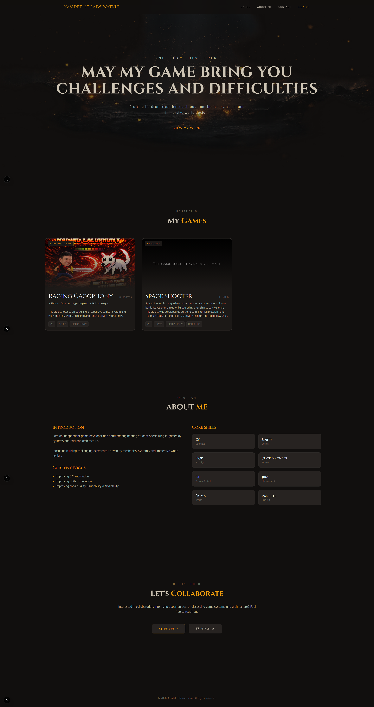

### Without Data
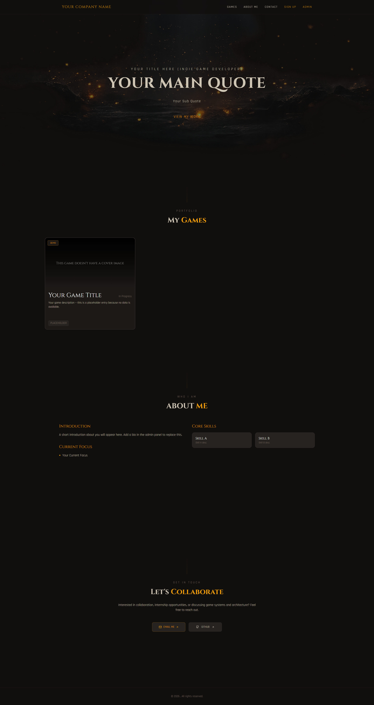

---

## Game Detail Page
### With Data
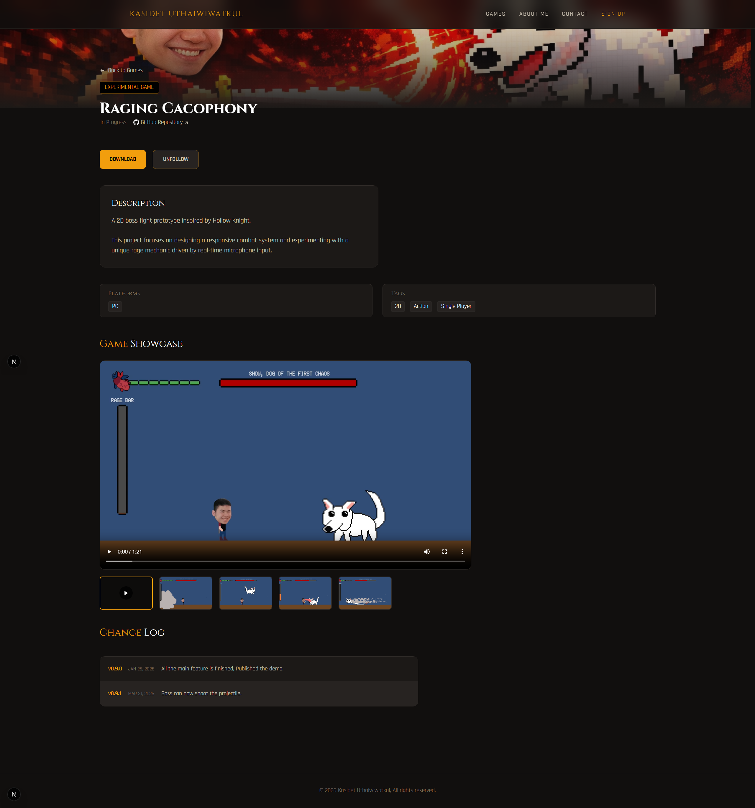
### Without Data
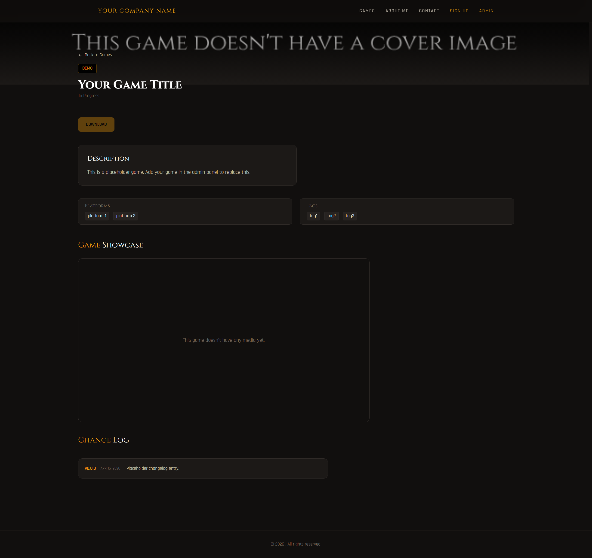

---

## Job Contact Page
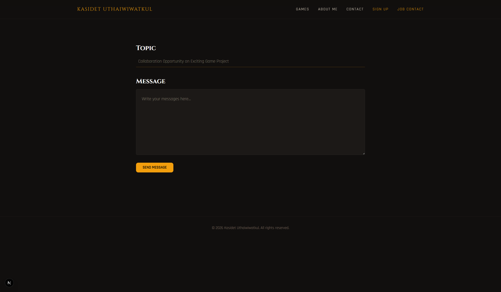

---

## Sign-Up Page
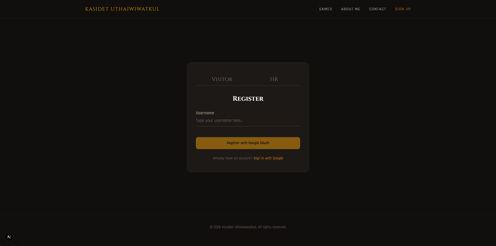

---

## Admin Page

### Profile 
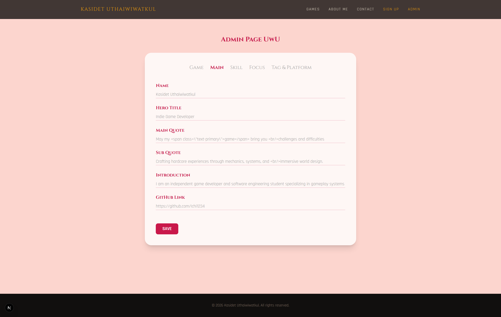

### Game
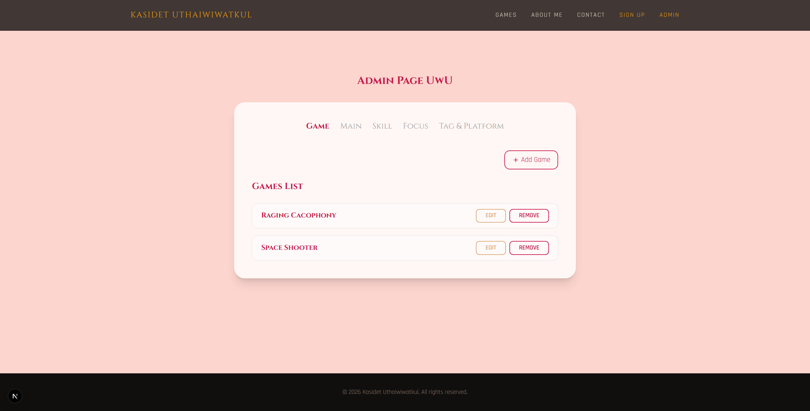

### Game Editing
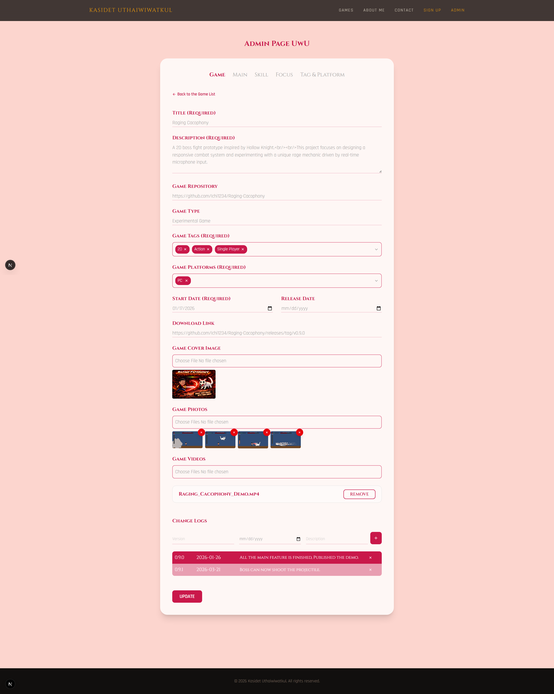


### Focus
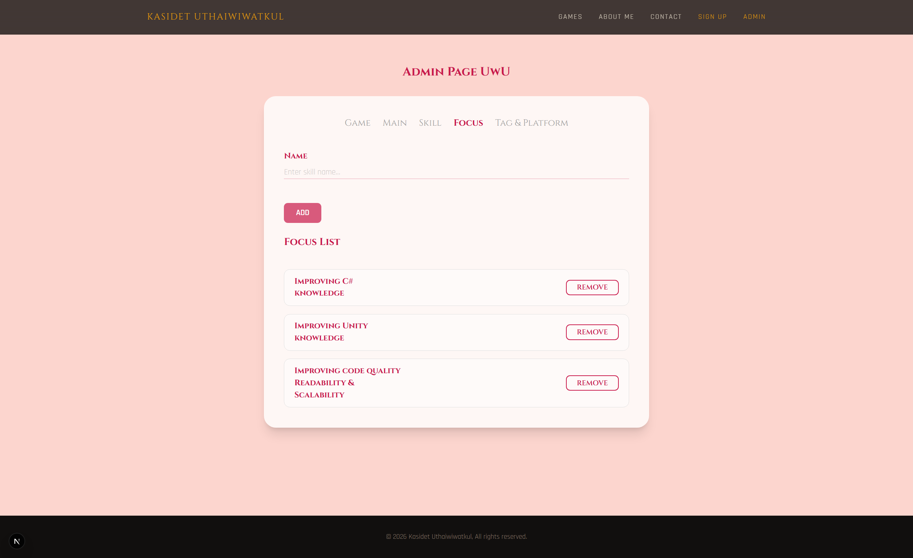

### Skill
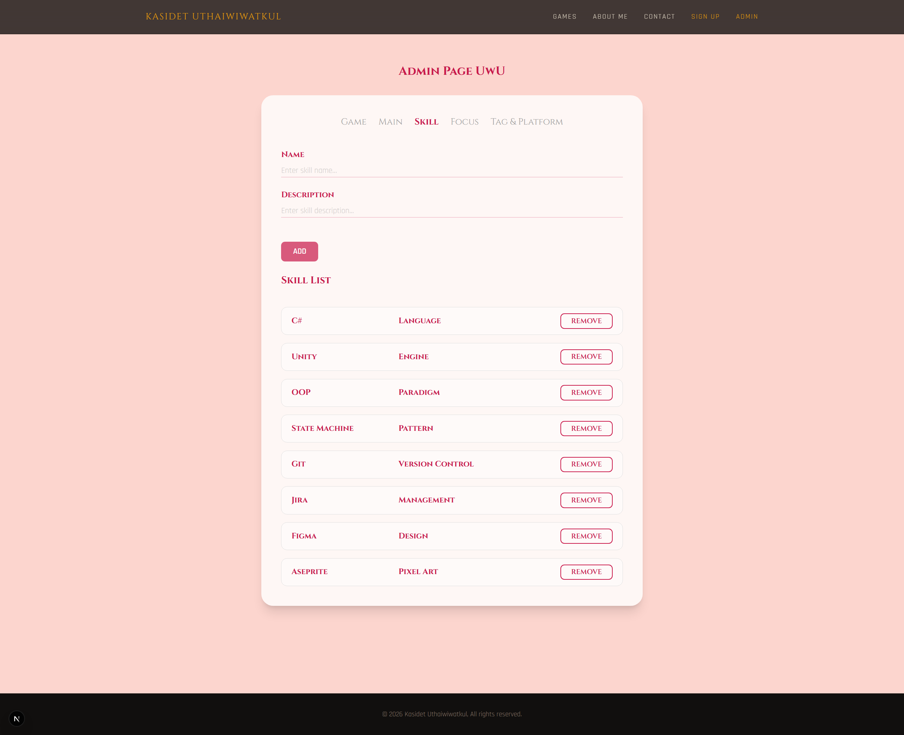

### Tag & Platform
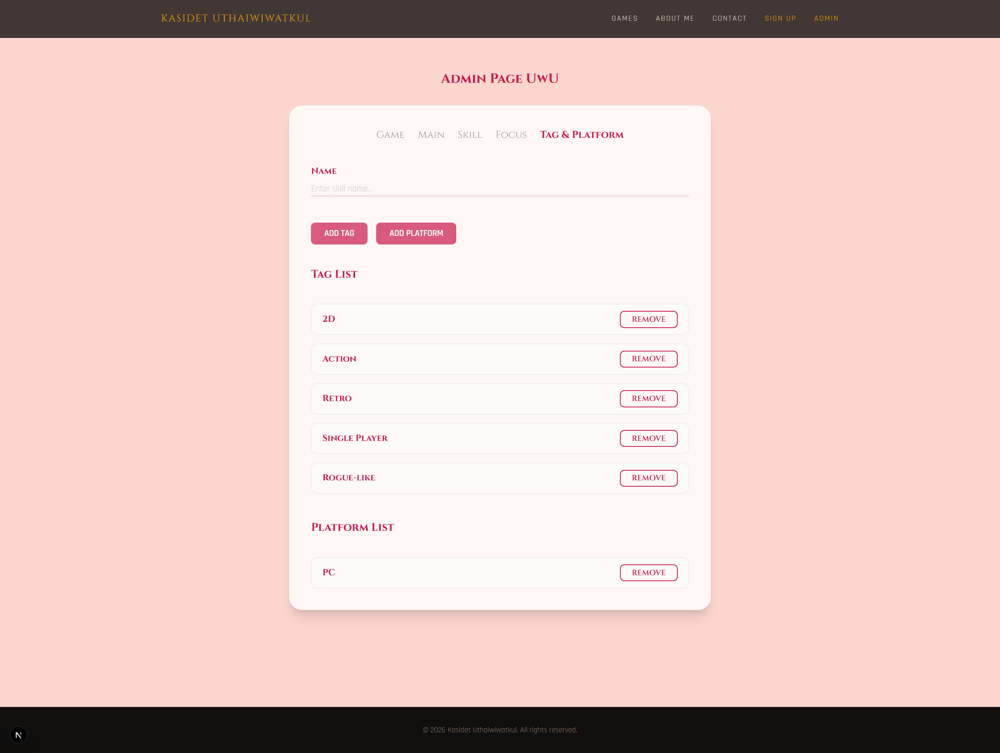

# Repository Structure

```
root/
│
├── frontend/                   # Next.js (presentation layer)
│   ├── app/                    # Next.js routes and pages
│   ├── components/             # Reusable UI components
│   ├── context/                # React contexts/providers
│   ├── public/                 # Static assets (img/, video/)
│   ├── utils/                  # Helper functions and formatters
│   └── (configs)               # tailwind.config.js, next.config.ts, package.json
│
├── backend/                    # FastAPI (application + data layer)
│   ├── app/
│   │   ├── application/        # routers, services, schemas, security
│   │   └── data/               # database.py and SQLAlchemy models
│   ├── main.py
│   └── requirements.txt
│
├── docker-compose.yml
├── INSTALLATION.md
├── LICENSE
└── README.md
```

---


# Academic Purpose

This project was developed as part of a Software Architecture course assignment to demonstrate:

- Practical implementation of architectural principles
- Clean code structure
- Secure system design
- Role-based access control